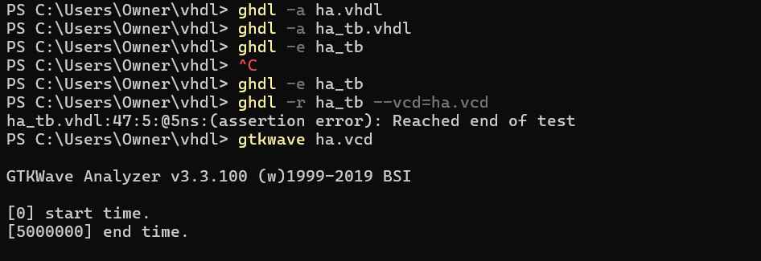

# **<ins>Lab 1 — GHDL and GTKWave</ins>**
## **<ins>Half Adder</ins>**
### **Code**

### **Output**

## **<ins>4-to-1 Multiplexer</ins>** 
### **Code**

### **Output**

# **<ins>Lab 2 — Command Line</ins>**
