# **<ins>Lab 10 — Blockchain </ins>**
## **<ins> Hash Function with Randomization </ins>**
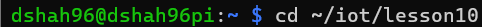
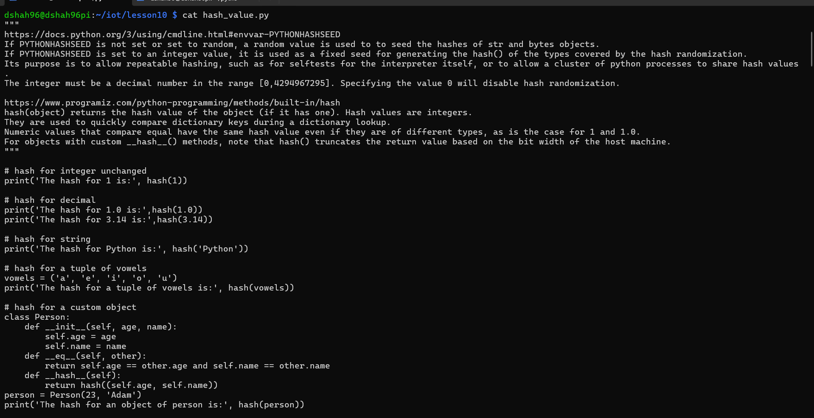
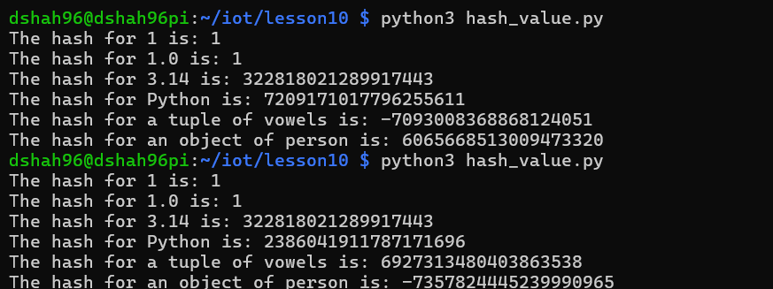
## **<ins> SHA-2 Secure Hash Algorithm </ins>**
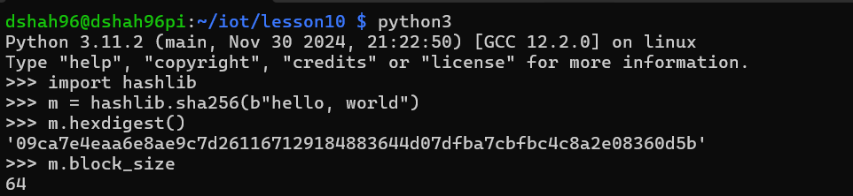
## **<ins> Tiniest Blockchain Part 1 by Gerald Nash </ins>**
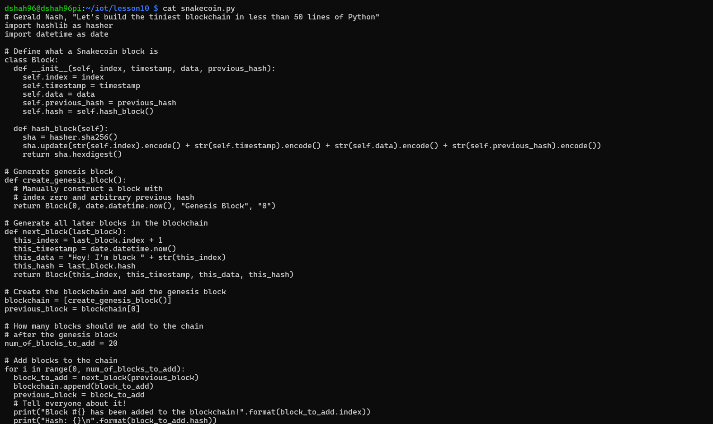
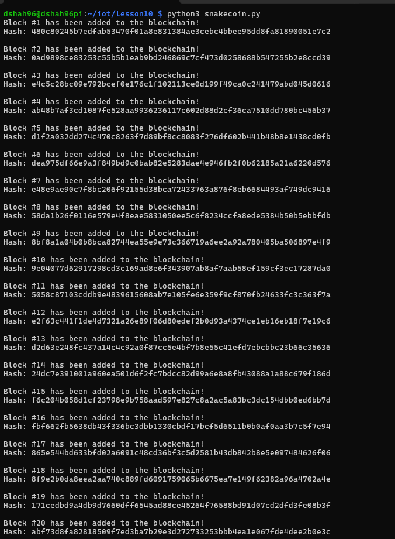
## **<ins> Tiniest Blockchain Part 2 by Gerald Nash </ins>**
### **<ins> Terminal 1 </ins>**
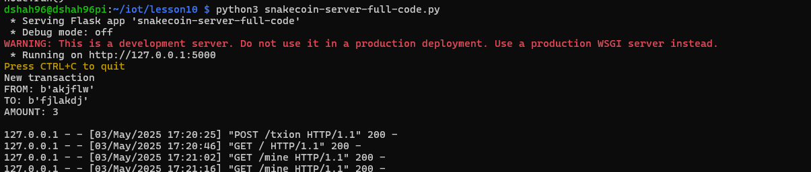
.png)
.png)
.png)
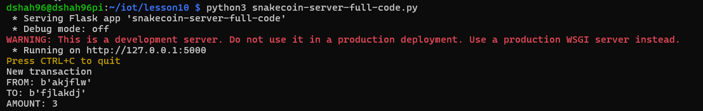

### **<ins> Terminal 2 </ins>**
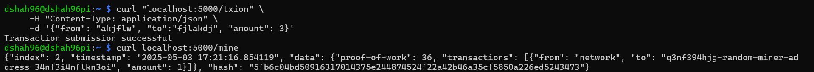

### **<ins> Output </ins>**
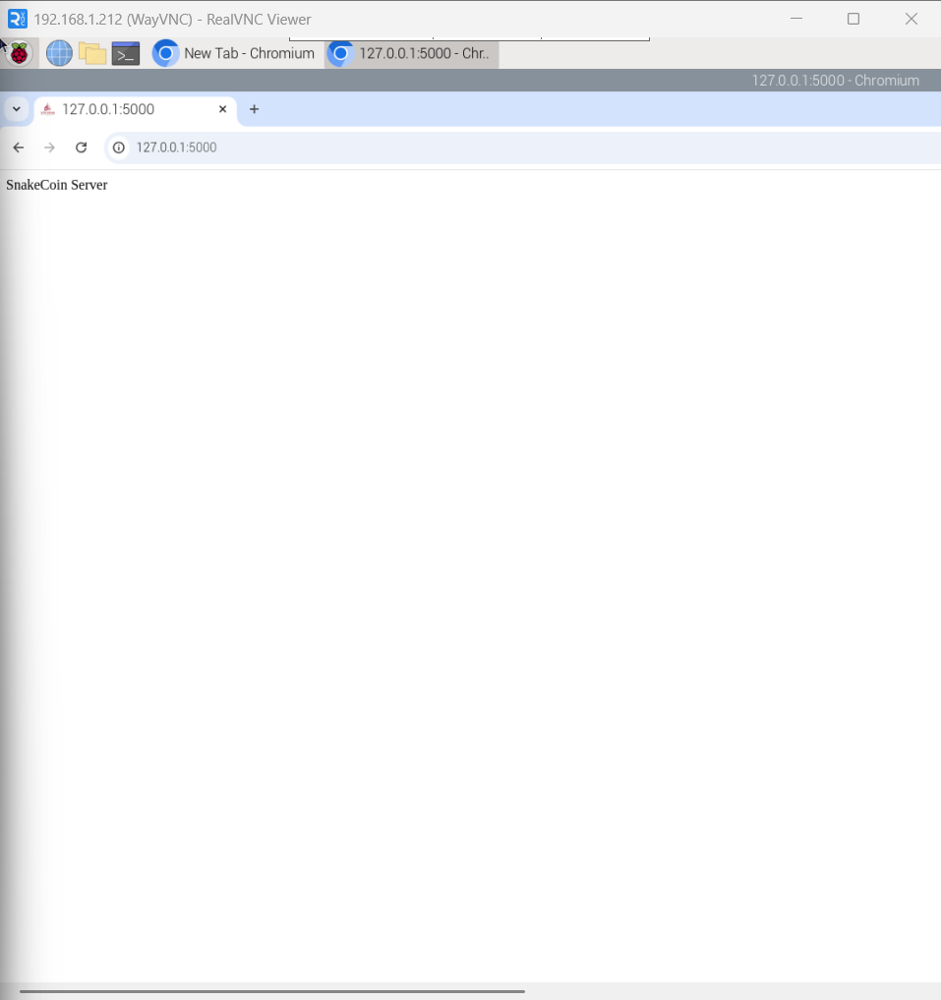
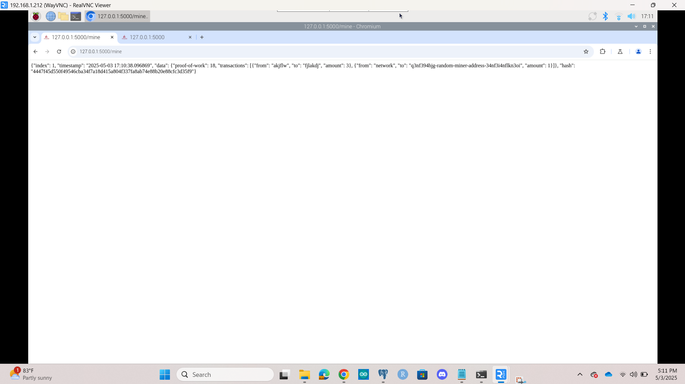

## **<ins> Python BlockChain App by Satwik Kansal </ins>**
### **<ins> Terminal 1 </ins>**

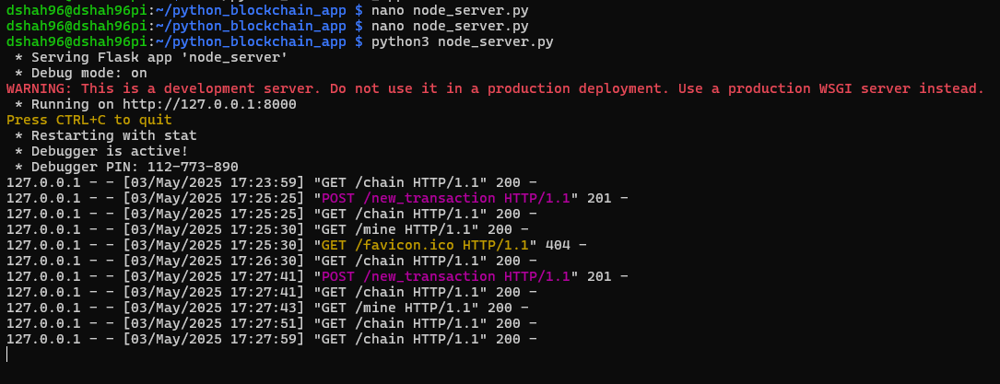

### **<ins> Terminal 2 </ins>**
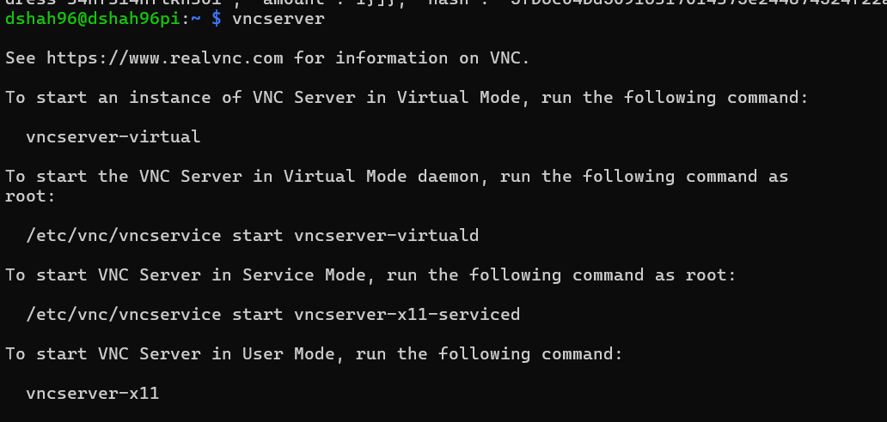
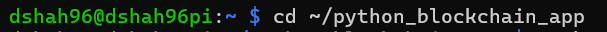
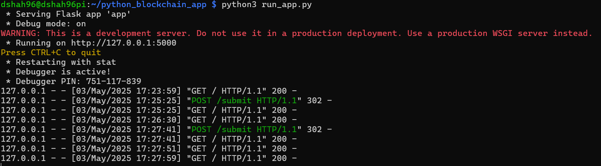

### **<ins> Output </ins>**
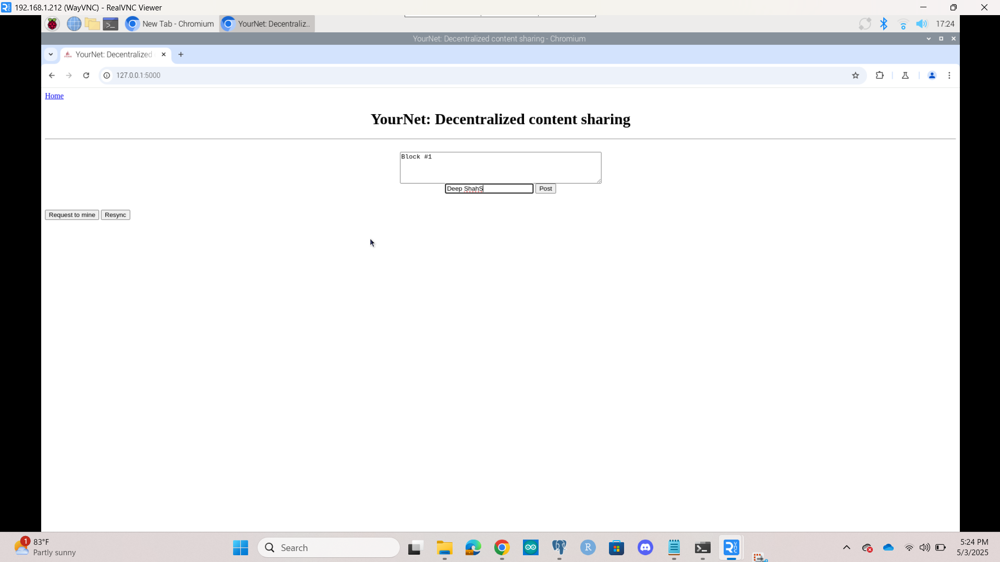
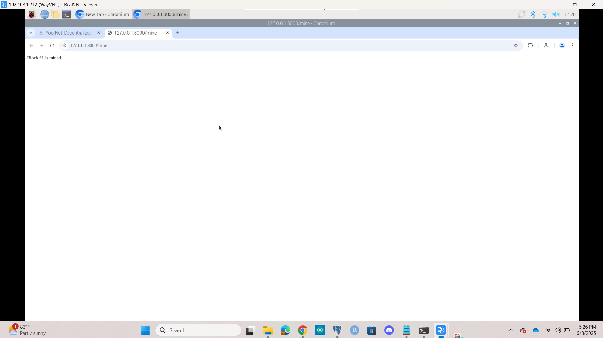
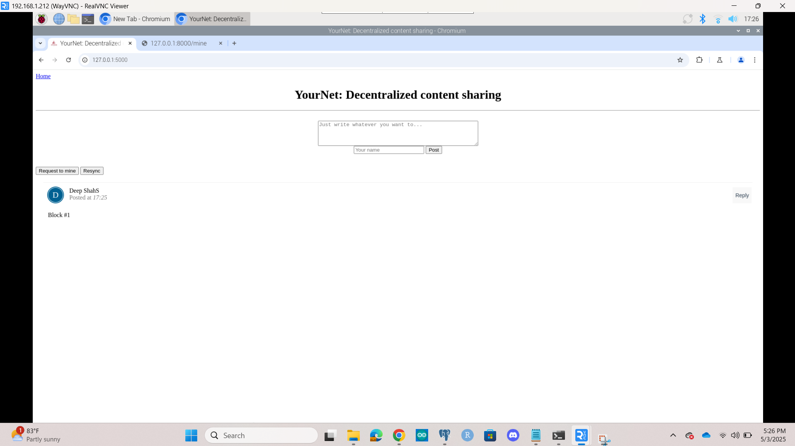

