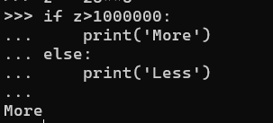
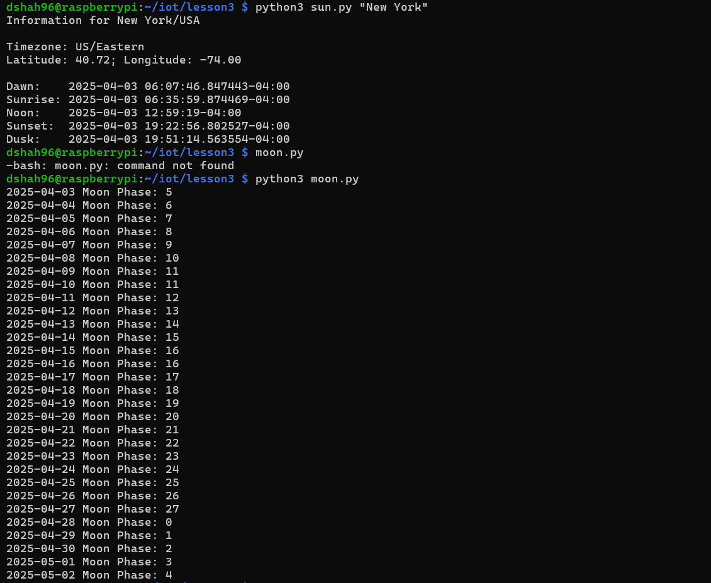

# **<ins> Lab 3 — Python </ins>**
## **<ins> Numbers: Int, Float, and Complex </ins>**
### **Code/Output**

## **<ins> Strings: text and binary data </ins>** 
### **Code/Output**

## **<ins> Tuples </ins>** 
### **Code/Output**

## **<ins> Lists </ins>** 
### **Code/Output**

## **<ins> Dictionaries </ins>** 
### **Code/Output**

## **<ins> If else </ins>** 
### **Code/Output**

## **<ins> If not </ins>** 
### **Code/Output**

## **<ins> For </ins>** 
### **Code/Output**

## **<ins> While </ins>** 
### **Code/Output**

## **<ins> Break </ins>** 
### **Code/Output**

## **<ins> Continue (or pass) </ins>** 
### **Code/Output**

## **<ins> Mathematical Functions </ins>** 
### **Code/Output**

## **<ins> Built-in Functions </ins>** 
### **Code/Output**

## **<ins> Defining Functions </ins>** 
### **Code/Output**

## **<ins> Defining Functions </ins>** 
### **Code/Output**

## **<ins> Keyword Arguments </ins>** 
### **Code/Output**

## **<ins> Variable-length arguments </ins>** 
### **Code/Output**

## **<ins> Modules </ins>** 
### **Code/Output**

## **<ins> Read and Write Files </ins>** 
### **Code/Output**

## **<ins> Install Jdcal, Astral, and Geopy </ins>** 

## **<ins> Git </ins>** 

## **<ins> Julian, Date_Example, and Date Time_Example </ins>** 

## **<ins> Sun, Moon </ins>** 

## **<ins> Coordinates, Address, CPU, Battery, and Documentstats </ins>** 

