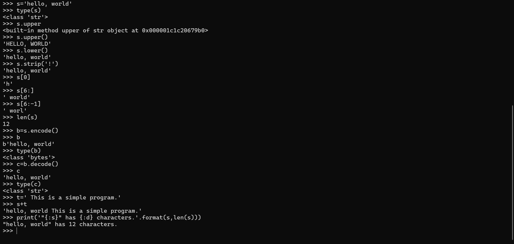

# **<ins> Lab 3 — Python </ins>**
## **<ins> Numbers: Int, Float, and Complex </ins>**
### **Code/Output**

## **<ins>Strings: text and binary data </ins>** 
### **Code/Output**

## **<ins>Tuples </ins>** 
### **Code/Output**

## **<ins>Lists </ins>** 
### **Code/Output**

