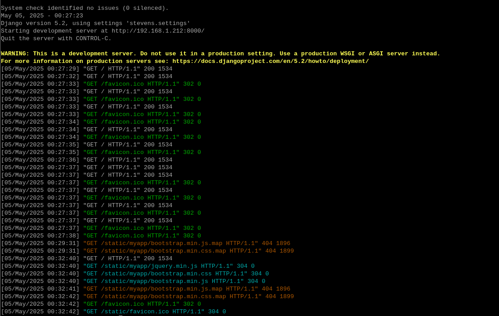
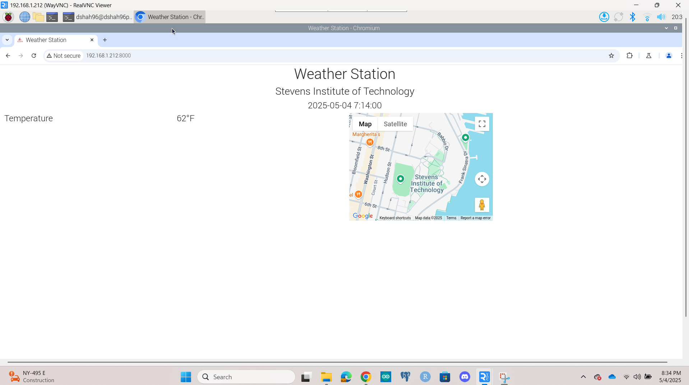
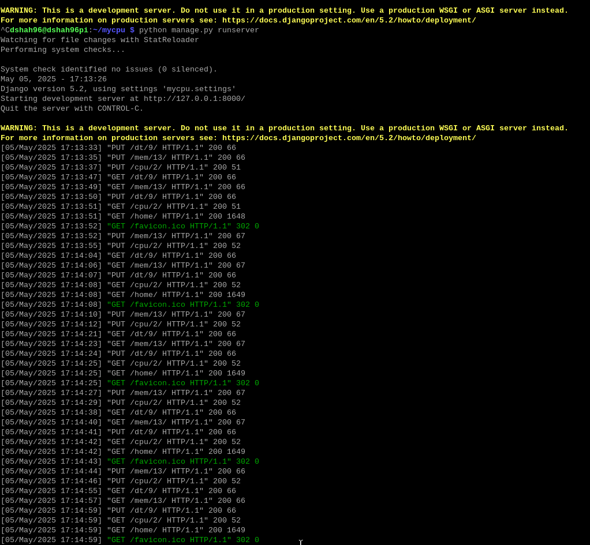
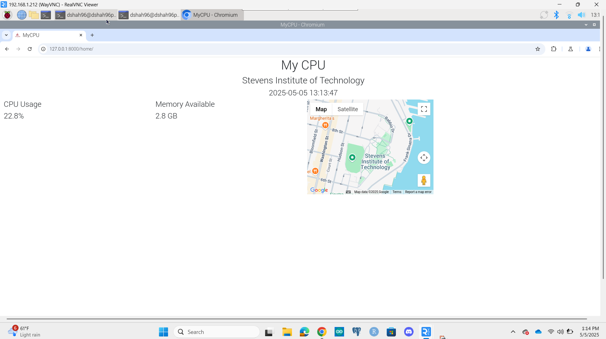
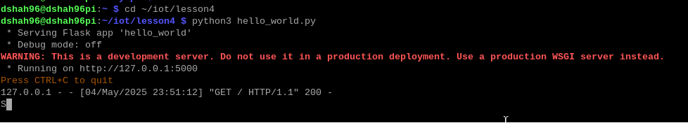
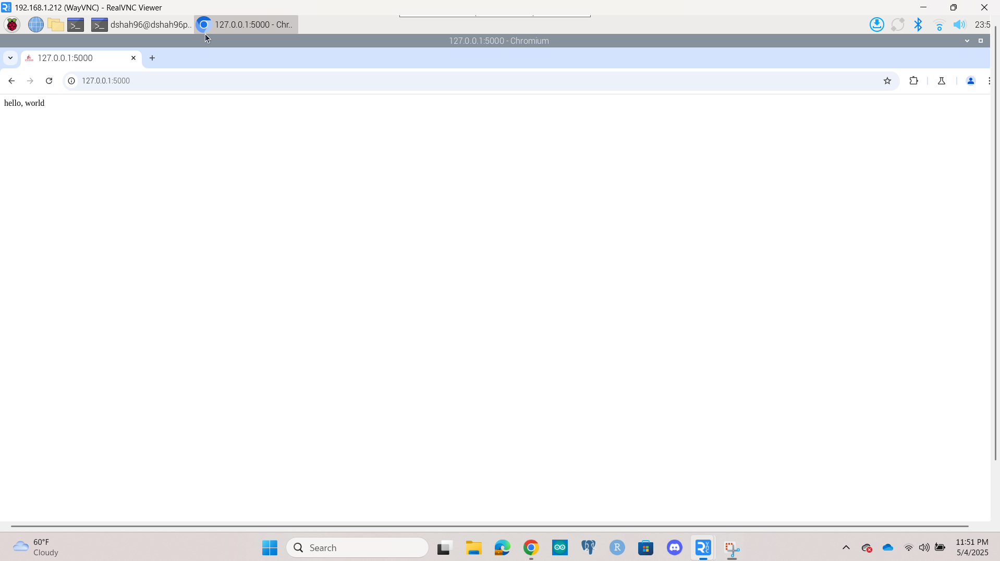
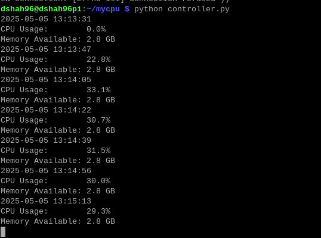

# **<ins> Lab 4 — Django and Flask </ins>**
## **<ins> Weather Station App </ins>**
### **Code for Weather Station App**

### **Output for Weather Station App**

## **<ins> MyCPU App </ins>**
### **Code for MYCPU App**

### **Output for Weather Station App**

## **<ins> Flask </ins>**
### **Code for MYCPU App**

### **Output for Weather Station App**

## **<ins> Controller Python File </ins>**
### **Code/Output for Controller.py**

