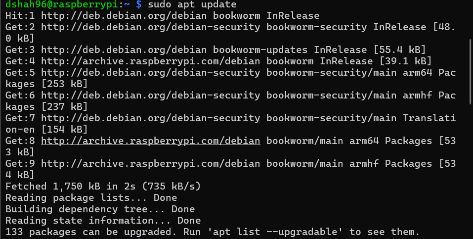
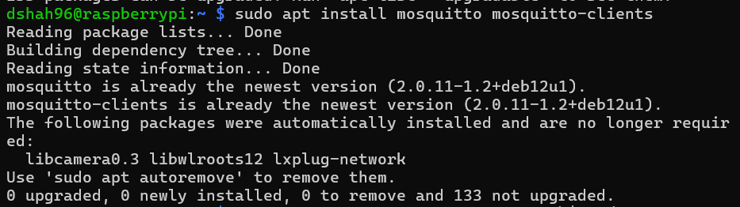
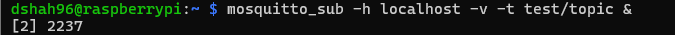
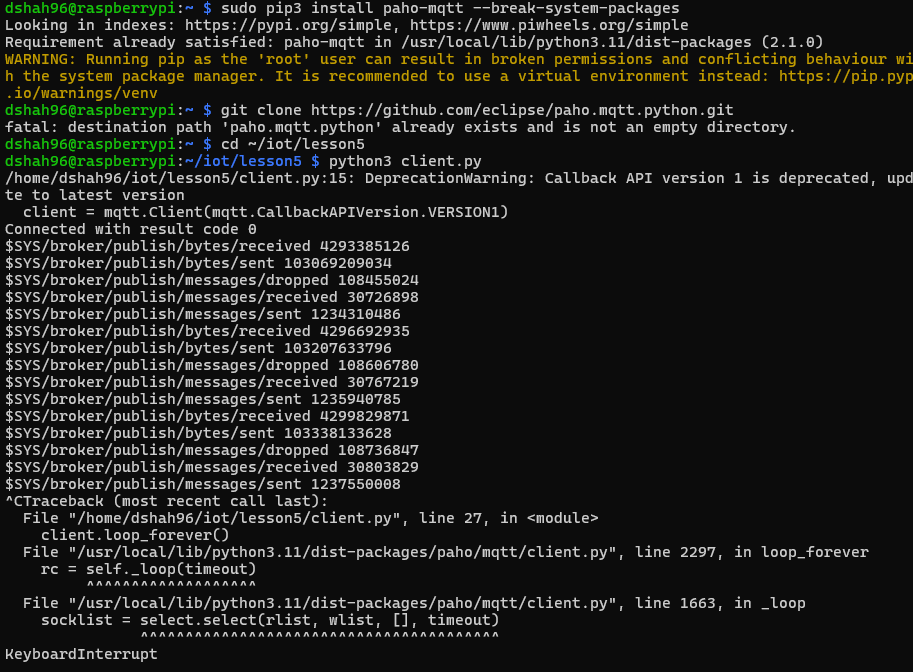
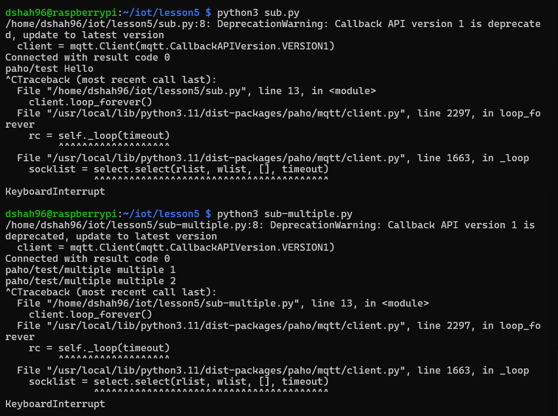
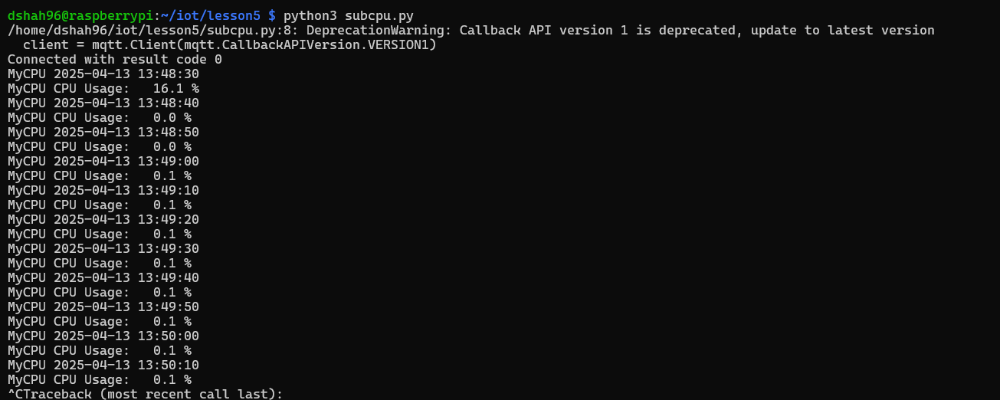

# **<ins>Paho-MQTT</ins>**
## **<ins>Terminal 1</ins>**
### **On Raspberry Pi, install and run Mosquitto to subscribe on one terminal and publish on another**

### **Terminal 1: Test/Topics**

### **Intall Paho and run code to subscribe on one terminal and publish on another**

### **Terminal 1: Sub.Py/Sub-multiple.py**

### **Terminal 1: Subcpu.Py**

## **<ins>Terminal 2</ins>**

