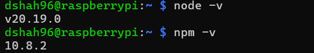

# **<ins>Lab 6 — Node.js and Pystache</ins>**
## **<ins>Half Adder</ins>**
### **Node and Node Package Manager (NPM) Versions**

### **Header file used in Node.js development: Node.h**

## **<ins>4-to-1 Multiplexer</ins>** 
### **Code**

### **Output**

