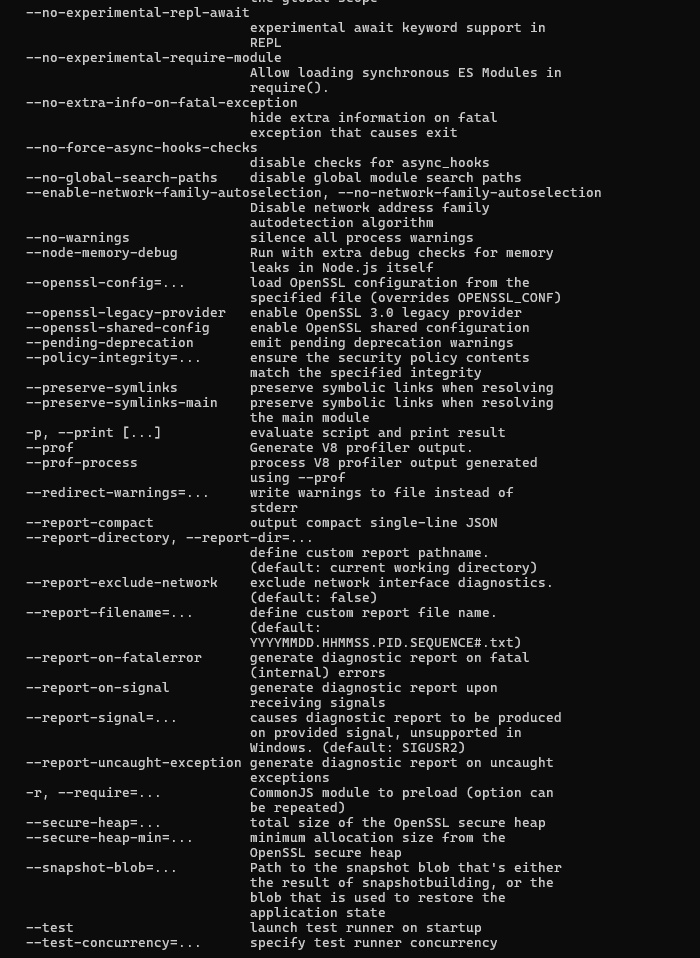

# **<ins>Lab 6 — Node.js and Pystache</ins>**
## **<ins>Node.js</ins>**
### Code
#### **Node and Node Package Manager (NPM) Versions**

#### **Header file used in Node.js development: Node.h**

#### **Hello-world.js, Hello.js, Http.js**

### Output
#### **Hello.js, Hello-world.js, Http.js**

## **<ins>Pystache</ins>** 

