# **<ins>Lab 8 — Data Analysis </ins>**
## **<ins> Numpy Array</ins>**
.png)
.png)
.png)

## **<ins> Review and Run Python Code </ins>** 
### **PyPlot Simple**
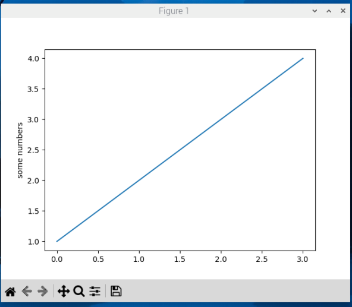
### **Simple Plot**
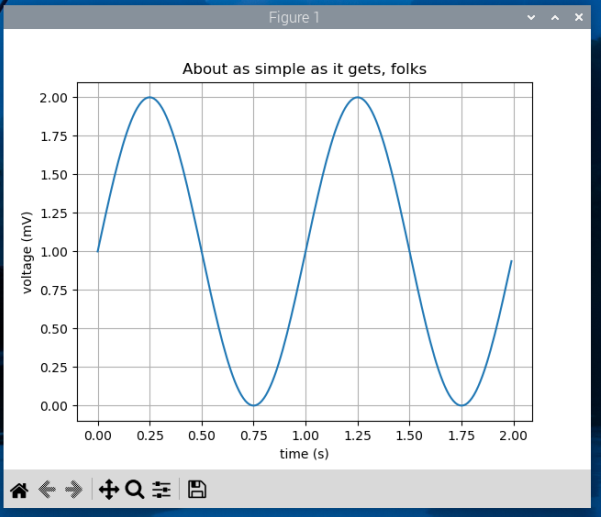
### **PyPlot Formatstr**
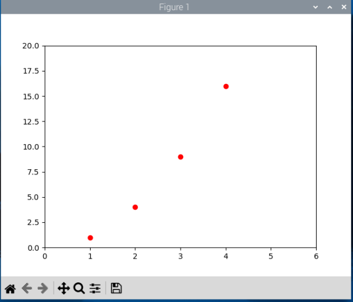
### **Ticklabels Demo Rotation**
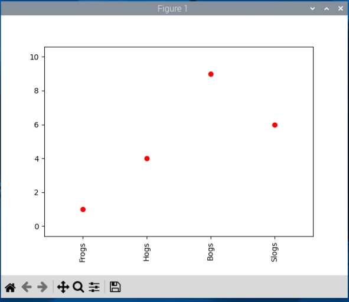
### **PyPlot Three**
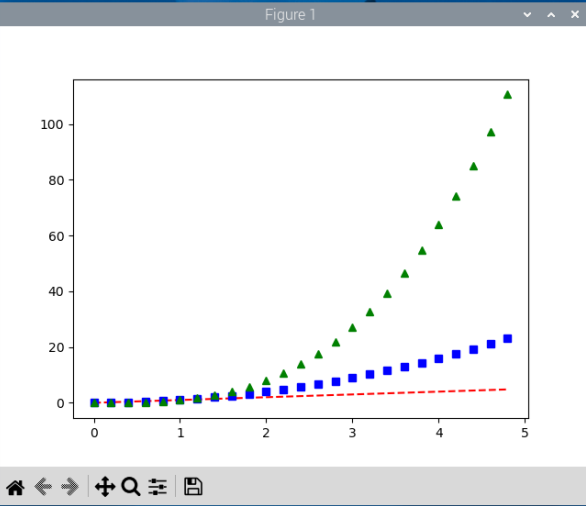
### **PyPlot Scales**
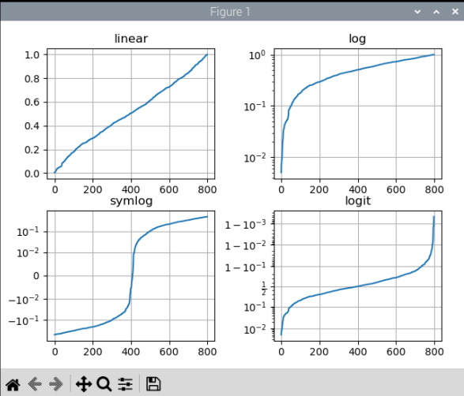
### **PyPlot Annotate**
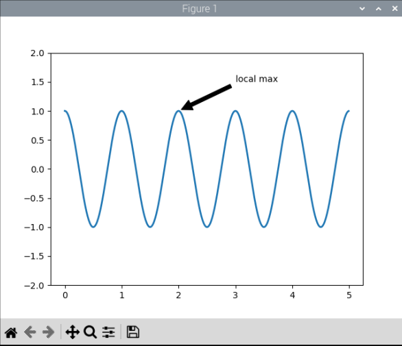
### **Major Minor Demo1**
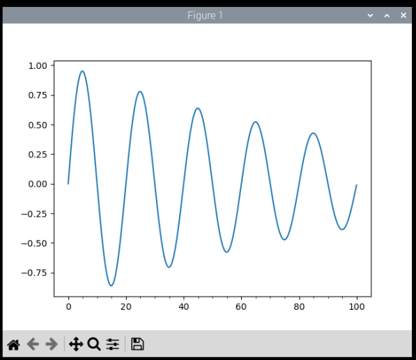
### **Legend Demo**
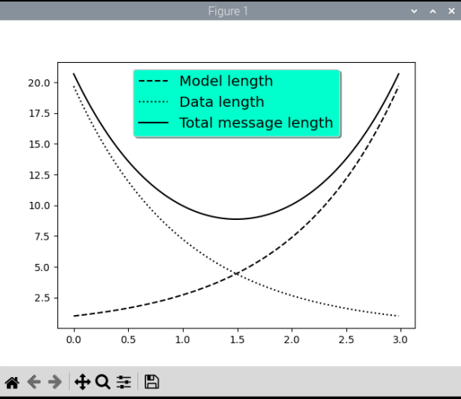

## **<ins> Histograms, box plots, regression, and interpolation </ins>** 
### **Scatter Demo**
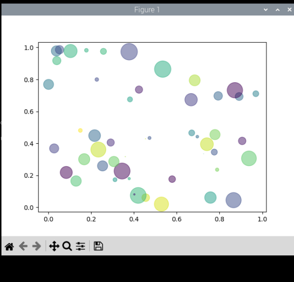
### **Histogram Demo Features**
.png)
.png)
.png)
### **PyPlot Text**
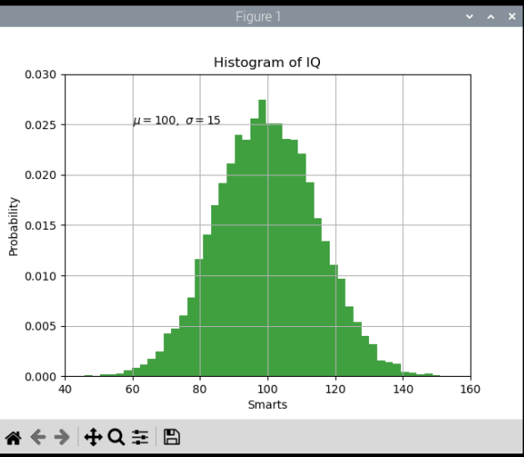
### **Histogram Demo Extended**
.png)
.png)
.png)
### **Boxplot Demo**
.png)
.png)
### **Linear Regression**
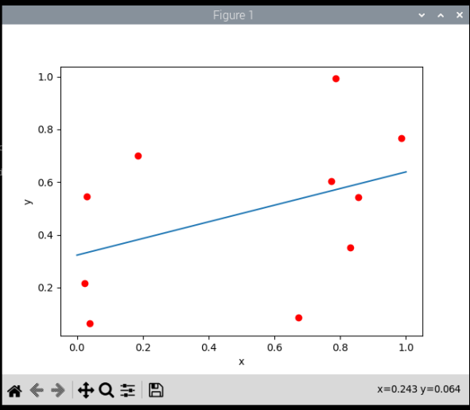
### **Interpolation**
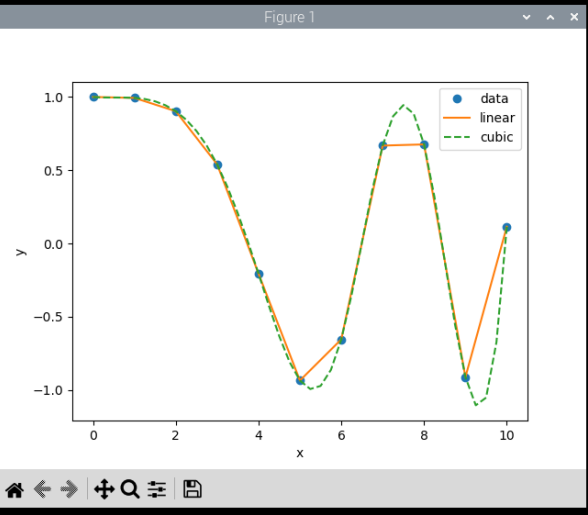

## **<ins> Classification, cross-validation (CV), and support-vector machine (SVM) </ins>** 
### **Plot lda**
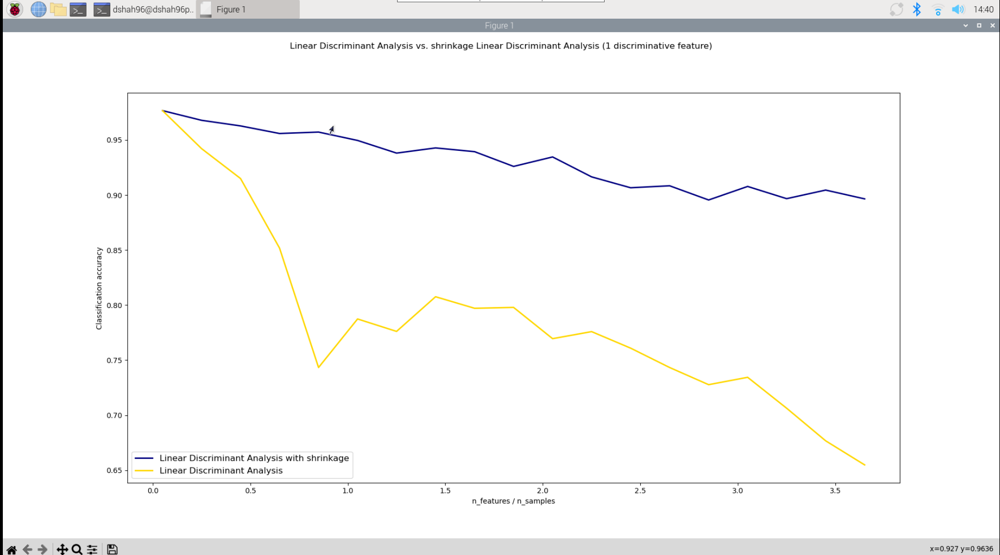
### **Plot lda_qda**
#### **Code**
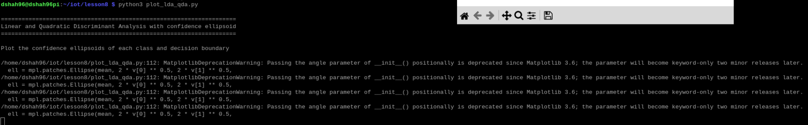
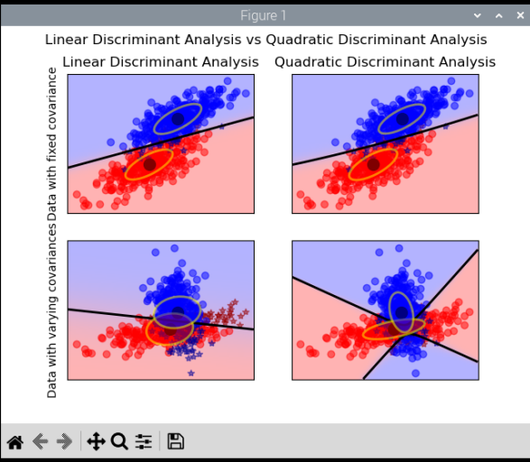
### **Plot Cross-Validation Predict**
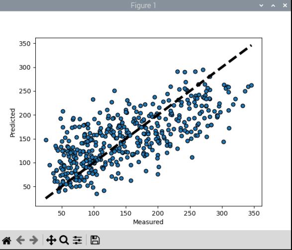
### **Plot Cross-Validation Diabetes**

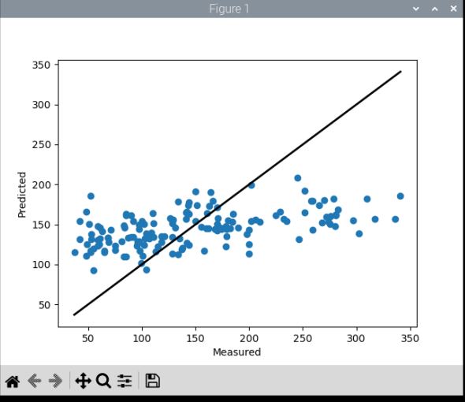
### **Traffic**

## **<ins> Keras and TensorFlow </ins>** 
### **Keras Diabetes**
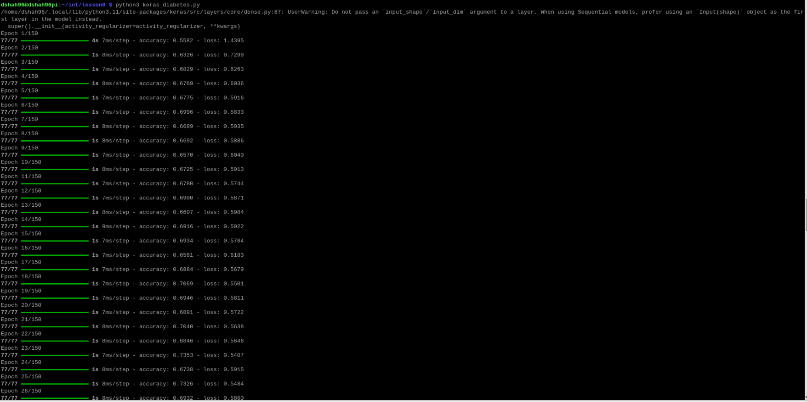
.png)
.png)
.png)
.png)
.png)

### **Keras First Network**
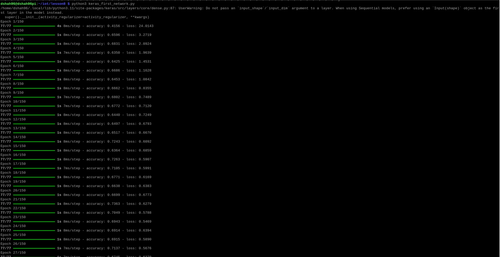
.png)
.png)
.png)
.png)
.png)

## **<ins> Titanic Examples </ins>** 
### **Titanic 1**
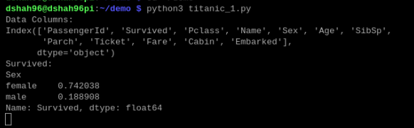
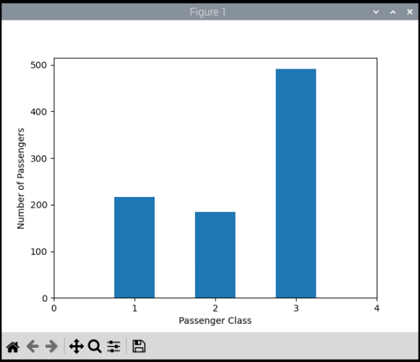
### **Titanic 2**
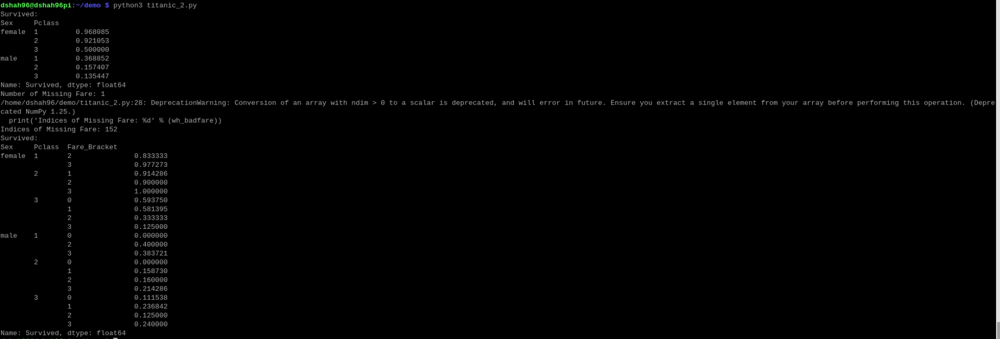

## **<ins> Final Plot </ins>** 
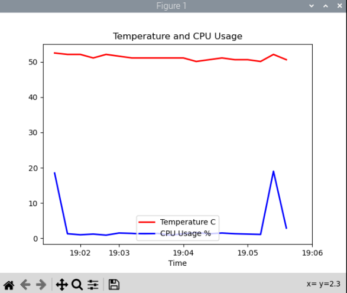
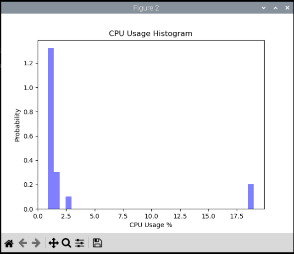
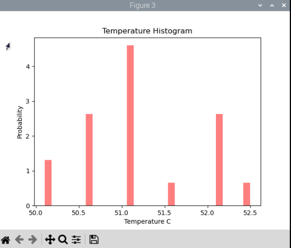
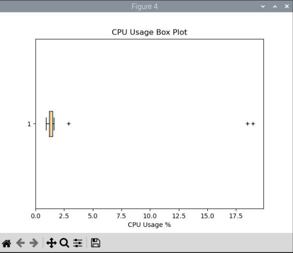
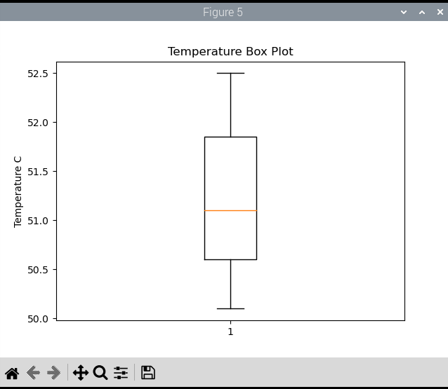
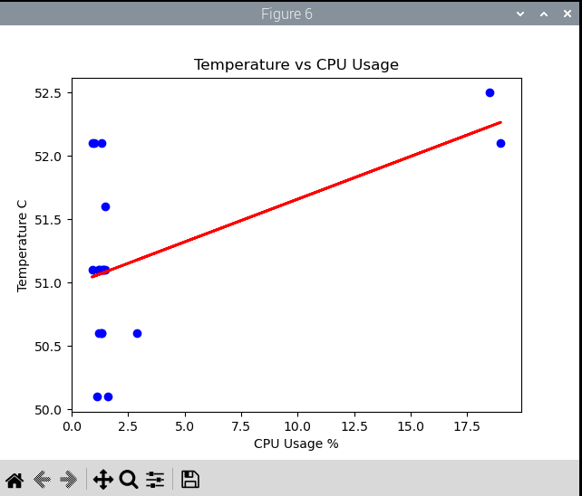

## **<ins> CV2 Plot </ins>** 
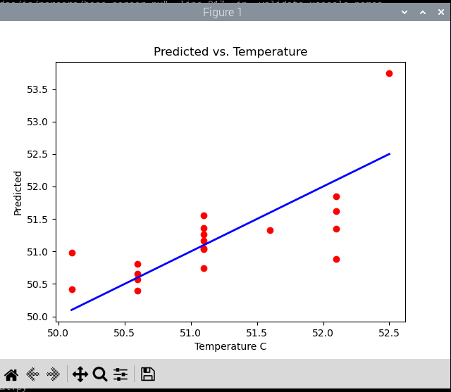

## **<ins> Nano File Edits </ins>** 

.png)

