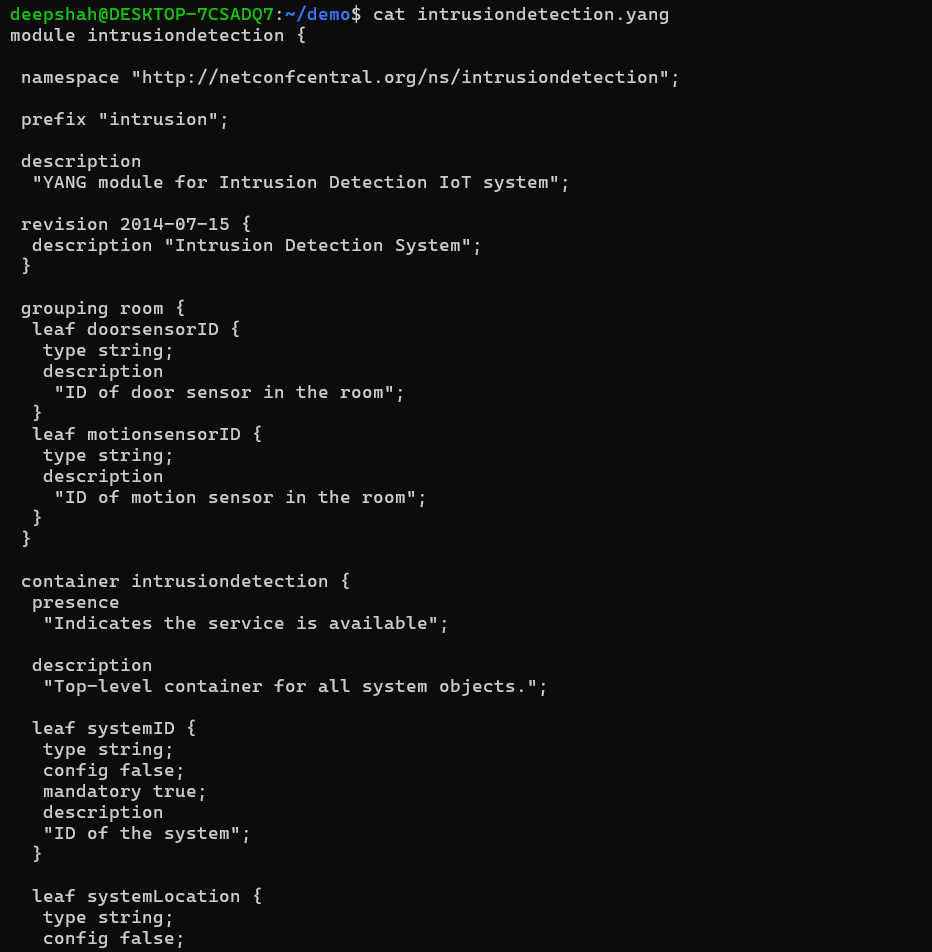

# **<ins>Lab 9 — Yang</ins>**
## **<ins>Node.js</ins>**
### Code
### **Git Clone of Professor Lu's Repository**

#### **Installation of Pyang & Plantuml**

#### **Files For Intrusion Detection**

#### **Cat Intrusion Detection Yang Files**

.png)
.png)
#### **Cat Intrusion Detection Yin Files**

.png)
.png)
.png)
## **<ins> Intrusiondetection.uml Intrusiondetection.yang </ins>** 

## **<ins> Cat Intrusion Detection UML File </ins>** 

## **<ins> Plantuml Intrusiondetection.uml </ins>** 

## **<ins> Install Pinta </ins>** 

## **<ins> Install GIMP </ins>** 

.png)
.png)
.png)
.png)
.png)
.png)
.png)

## **<ins> GIMP-H Intrusion Detection Output</ins>** 

## **<ins> Pinta Intrusion Detection Output</ins>** 
### **<ins> Code </ins>**

### **<ins> Output </ins>** 

## **<ins> GIMP Intrusion Detection Output</ins>** 
### **<ins> Code </ins>** 

### **<ins> Output </ins>** 

